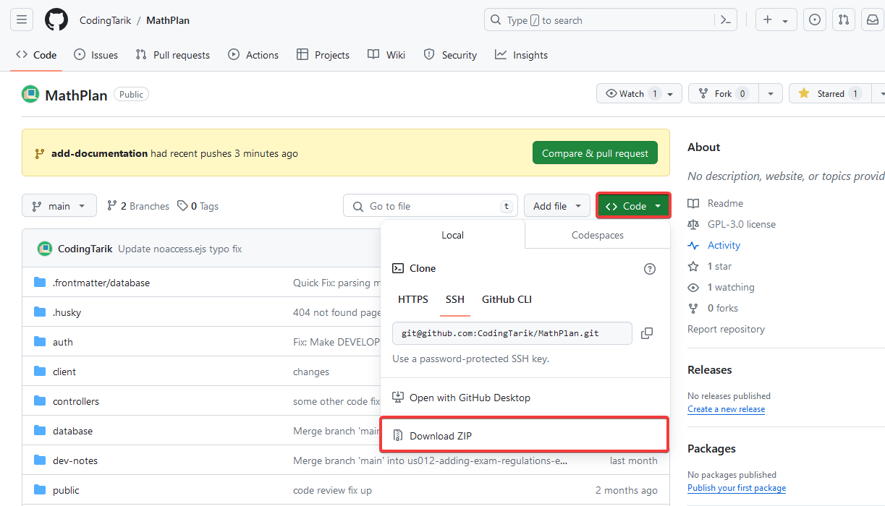
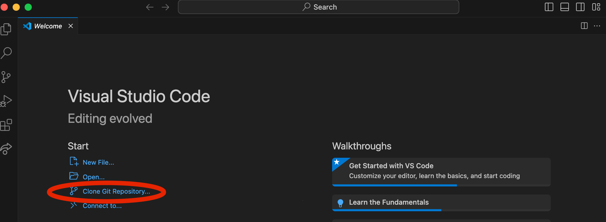
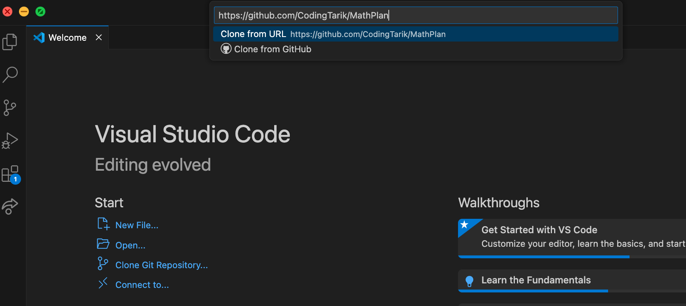

# Herunterladen und Installieren von MathPlan

Im Folgenden stellen wir zwei Möglichkeiten vor, wie das Projekt heruntergeladen und installiert werden kann.

## Vorraussetzungen

Um das Projekt auszuführen, muss NodeJS installiert sein ([https://nodejs.org/en](https://nodejs.org/en)). Laden Sie NodeJS von der offiziellen Website herunter und folgen Sie den Anweisungen des Installationsassistenten.

## Herunterladen und Installieren von GitHub

1. Öffnen Sie die Hauptseite des Projekts auf GitHub ([hier](https://github.com/CodingTarik/MathPlan/tree/main)).

2. Klicken Sie auf den grünen Button "Code" und wählen Sie "Download ZIP".

3. Entpacken Sie die ZIP-Datei in einen Ordner Ihrer Wahl.

4. Öffnen Sie das Terminal und navigieren Sie in den Ordner, in dem Sie das Projekt entpackt haben. Unter Windows können Sie hierzu einfach mit der rechten Maustaste auf den entpackten Ordner klicken und die Option "In Terminal öffnen" auswählen.

5. Geben Sie im Terminal den Befehl `npm start` ein. Dann werden alle notwendigen Abhängigkeiten installiert und die Anwendung wird gestartet. Dieser Vorgang kann beim ersten Mal etwas länger dauern.

## Herunterladen und Installieren via VSCode

Mit _Visual Studio Code_ lässt sich das Projekt wie folgt von GitHub klonen, sodass direkt Änderungen am Projekt vorgenommen werden können, diese committed werden können und somit nicht nur lokal vorhanden sind:

Zuerst wird `Clone Git Repository...` angeklickt, dann gibt man die url des Projekts ein.

Nun gibt man einen Zielordner an, indem das Projekt gespeichert werden soll, dann lässt sich das Projekt öffnen.

Dann kann beispielsweise direkt im Terminal in VSCode `npm run start` eingegeben werden, um die Anwendung zu starten.
