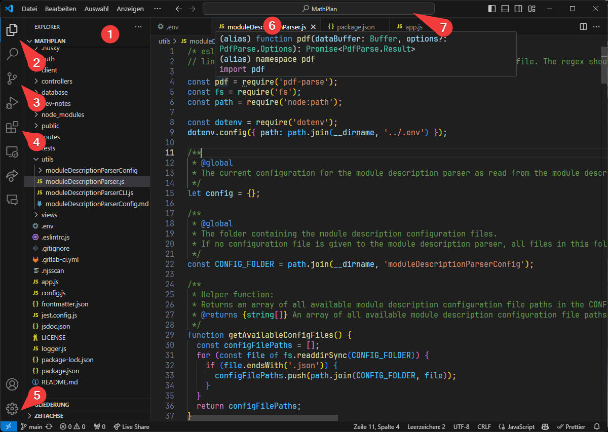
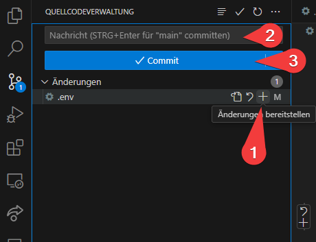

# Entwicklungsumgebung und Versionsverwaltung

Um _MathPlan_ weiterzuentwickeln oder anzupassen, verwendet man am besten einen Code-Editor oder eine integrierte Entwicklungsumgebung (IDE). Im Folgenden stellen wir kurz _Visual Studio Code_ und _Git_ vor, die wir für die Entwicklung von _MathPlan_ empfehlen.

## Visual Studio Code

Visual Studio Code ist ein kostenloser Code-Editor von Microsoft, der sich durch eine Vielzahl von Erweiterungen und eine gute Unterstützung für JavaScript und TypeScript auszeichnet.

Für detaillierte Informationen zur Verwendung von Visual Studio Code empfehlen wir die offizielle [Dokumentation](https://code.visualstudio.com/docs).

Visual Studio Code kann von der offiziellen [Website](https://code.visualstudio.com/) heruntergeladen werden. Folgen Sie den Anweisungen des Installationsassistenten, um Visual Studio Code auf Ihrem System zu installieren.

Das Visual-Studio-Code-Fenster sieht beispielsweise so aus:

Wir erklären kurz die wichtigsten Bestandteile:

- **Datei-Explorer (1):** Hier werden alle Dateien und Ordner des aktuellen Projekts angezeigt.
- In der linken Leiste finden Sie die Schaltflächen für die verschiedenen Ansichten und Aktionen. Mithilfe der **Datei-Explorer-Schaltfläche (2)** können Sie den Datei-Explorer ein- oder ausblenden.
- Mithilfe der **Versionskontrolle-Schaltfläche (3)** können Sie Git-Repositories verwalten.
- Über die **Paket-Schaltfläche (4)** können Sie Erweiterungen installieren und verwalten. Für _MathPlan_ sollte jedoch die Grundinstallation von Visual Studio Code zunächst ausreichen. Allerdings können wie das "German Language Pack for Visual Studio Code" empfehlen, um die Benutzeroberfläche auf Deutsch umzustellen. 
- Über das **Zahnrad-Symbol (5)** können Sie die Einstellungen von Visual Studio Code anpassen.
- Um eine Datei zu öffnen, klicken Sie einfach auf den Dateinamen im Datei-Explorer. Die Datei wird dann im rechten von Visual Studio Code geöffnet und kann bearbeitet werden. Über die Leiste über dem Dateiinhalt **(6)** können Sie zwischen mehreren geöffneten Dateien wechseln.
- Über die **Suchleiste (7)** finden Sie Dateien und Textstellen in Ihrem Projekt. Zudem können Sie hier auch nach Einstellungen und Aktionen von Visual Studio Code suchen, indem Sie Ihre Suchanfrage mit einem `>` beginnen.

Ein Terminal öffnen Sie in Visual Studio Code am einfachsten über den Menüpunkt `Terminal` > `Neues Terminal`. Hier können Sie dann die Entwicklungsserver von _MathPlan_ starten und die Ausgaben der Anwendung verfolgen. Sofern `Terminal` nicht in der Menüleiste angezeigt wird, klicken Sie zunächst auf die drei Punkte am rechten Rand der Menüleiste, um das Menü zu erweitern.

## Git

Git ist ein Versionsverwaltungssystem, das die Zusammenarbeit an Softwareprojekten erleichtert. Es ermöglicht es, Änderungen an Dateien zu verfolgen, zu speichern und zu synchronisieren. Git wird von _MathPlan_ verwendet, um den Quellcode zu verwalten und die Entwicklung zu koordinieren.

Git fasst Änderungen in sogenannten Commits zusammen. Ein Commit ist eine Sammlung von Änderungen an Dateien, die mit einer Beschreibung versehen ist. Commits können dann in einem zentralen Repository gespeichert und von anderen Entwicklern heruntergeladen werden.

Wenn Sie in Visual Studio Code ein Git-Repository geöffnet haben, können Sie über die Versionskontrolle-Schaltfläche **(3)** auf die Git-Funktionen zugreifen. Sobald eine Datei geändert wurde, wird sie in der Versionskontrolle-Schaltfläche mit einem blauen Punkt markiert. Klicken Sie auf die Schaltfläche, um die Änderungen zu sehen und einen Commit zu erstellen:

Um Änderungen zu einem Commit hinzuzuügen, klicken Sie auf das `+`-Symbol neben der Datei **(1)**. Geben Sie dann eine Beschreibung für den Commit ein **(2)** und klicken Sie auf das Häkchen **(3)**, um den Commit zu erstellen.

Damit dieser Commit nun auch für andere Entwicker:innen verfügbar ist, müssen Sie ihn in das zentrale Repository hochladen. Dazu klicken Sie auf die drei Punkte und wählen `Push` aus. Der Commit wird dann auf den Server hochgeladen und kann von anderen Entwickler:innen heruntergeladen werden, indem diese die Änderungen mit `Pull` abrufen.

Um Änderungen am GitHub-Repository durchführen zu können, benötigen Sie die entsprechenden Berechtigungen. Sollten Sie keine ausreichenden Berechtigungen für den Zugriff auf das Repository haben, können Sie ein Fork des Repositorys erstellen. Ein Fork ist eine Kopie des Repositorys, die Sie auf Ihrem eigenen GitHub-Account verwalten können. Klicken Sie hierzu auf der Hauptseite des Repositorys auf den Button `Fork`, den Sie oben rechts finden.

Für detaillierte Informationen zur Verwendung von Git empfehlen wir die offizielle [Dokumentation](https://git-scm.com/doc).
