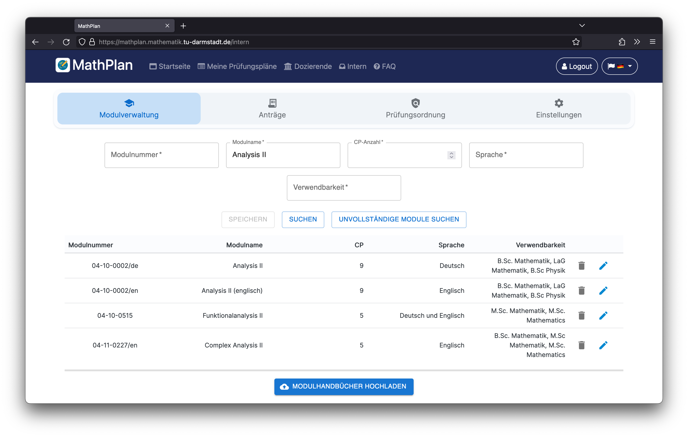

# MathPlan - Dokumentation

## Inhaltsverzeichnis

- [Herunterladen und Installieren von MathPlan](Herunterladen%20und%20Installieren.md)

* **Konfigurieren von MathPlan**
  - [Globale Konfiguration](Globale%20Konfiguration.md)
  - [Konfiguration des Modulhandbuch-Parsers](Modulhandbuch-Parser.md)
  - [Konfiguration der Prüfungsplan-Eingabemaske](Prüfungsplan-Eingabe.md)

- **Weiterentwicklung von MathPlan**
  - [Entwicklungsumgebung und Versionsverwaltung](IDE.md)
  - [Hinzufügen neuer Webseiten](Routing.md)
